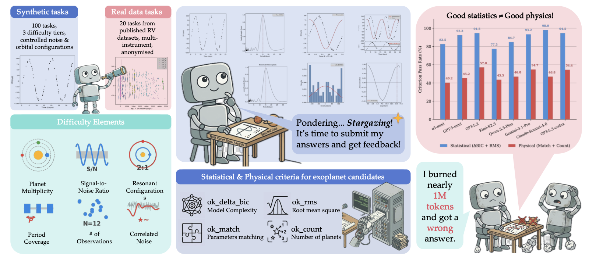
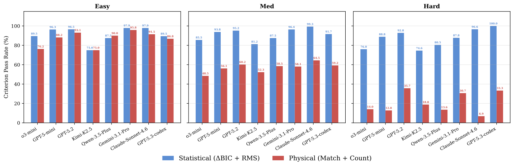
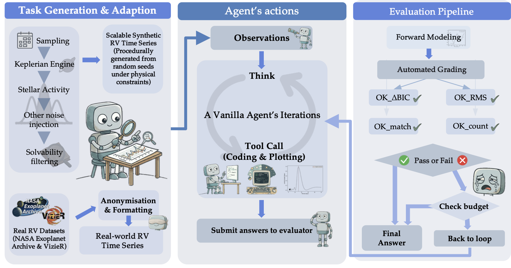
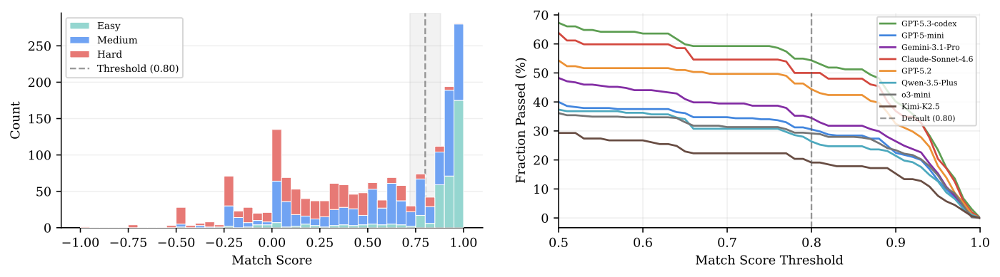

# Stargazer

**A Scalable Model-Fitting Benchmark Environment for AI Agents under Astrophysical Constraints**

Xinge Liu, Terry Jingchen Zhang, Bernhard Schölkopf, Zhijing Jin, Kristen Menou

University of Toronto · Vector Institute · Max Planck Institute for Intelligent Systems · ELLIS Institute Tübingen



Stargazer is a high-fidelity benchmark for evaluating LLM agents on **iterative, physics-grounded scientific reasoning**. Agents are placed in an exoplanet-discovery workflow: given noisy radial-velocity (RV) time series for a star, they must run periodogram analysis, fit Keplerian orbital models, and submit a planetary configuration that matches an unseen ground truth on **four simultaneous criteria** — statistical fit, residual RMS, per-planet parameter match, and planet count.

The benchmark contains **120 tasks** — 100 procedurally generated synthetic systems (graded by difficulty 1–10) and 20 real archival systems from the NASA Exoplanet Archive — and exposes a clean ReAct-style environment with `PythonREPL` and `submit_action` tools.

## Headline Findings

Across 8 frontier models, agents reliably produce a *good statistical fit* but consistently fail to *recover the right physical parameters*. The gap widens with difficulty and persists with extra compute or domain-expert skill injection.



- **Statistical fit (ΔBIC + RMS)** stays above ~70% on Hard for every model.
- **Physical recovery (Match + Count)** drops below 40% on Hard for every model.
- **Real-world subset (20 tasks)**: 0 / 8 frontier models solve a single case.
- More test-time tokens do not buy proportional gains; failed agents often loop on the same wrong hypothesis.

### Main Results

Pass Rate (%) on synthetic tiers and on the 20 real-data tasks. **Bold** = best per column; *italic* = second best.

| Model | Easy | Medium | Hard | Real (20) |
|---|---:|---:|---:|---:|
| Classical Pipeline (baseline) | 95.0 | 35.0 | 5.0 | — |
| Nested Sampling (baseline) | 95.0 | 32.5 | 0.0 | — |
| o3-mini | 40.0 | 24.2 | 0.0 | 0.0 |
| GPT-5-mini | *76.7* | *33.6* | 2.5 | 0.0 |
| GPT-5.2 | 40.0 | 30.0 | **5.8** | 0.0 |
| Kimi-K2.5 | 13.3 | 17.9 | 0.8 | 0.0 |
| Qwen-3.5-Plus | 26.7 | 25.0 | 1.6 | 0.0 |
| Gemini-3.1-Pro | 71.7 | **35.0** | *5.0* | 0.0 |
| Claude-Sonnet-4.6 | 68.3 | 22.5 | 0.8 | 0.0 |
| GPT-5.3-codex | **80.0** | 30.8 | 4.2 | 0.0 |

Even on real systems where the truth comes from peer-reviewed published solutions, no frontier model achieves a single pass — providing evidence against benchmark contamination.

## Framework



- **Task generation.** Synthetic tasks are produced by a Keplerian engine (with optional REBOUND N-body integration) under physics-controlled difficulty axes — planet multiplicity, SNR, resonant configuration, period coverage, observation count, and correlated noise. Real tasks are anonymised and reformatted from archival RV catalogs.
- **Agent loop.** A ReAct-style loop with two tools: `PythonREPL` (analysis code) and `submit_action` (propose a candidate system, receive per-criterion feedback). Agents may submit multiple times; only the best submission counts.
- **Evaluator.** The agent's submitted Keplerian parameters are forward-modelled, then graded against the ground-truth system on four pass/fail criteria.

## Evaluation Criteria

A task counts as solved only when **all four** criteria hold simultaneously:

| Criterion | Definition |
|---|---|
| `ok_delta_bic` | Submitted model is statistically preferred over a flat-line null (ΔBIC > 10). |
| `ok_rms` | Residual RMS ≤ 1.5 × median measurement uncertainty. |
| `ok_match` | Per-planet match score (Hungarian assignment, exp(−d) on parameter distance) ≥ 0.8. |
| `ok_count` | Recovered planet count equals truth count. |

The match-score threshold of 0.8 sits in a sharp bimodal valley of the empirical distribution — sweeping ±10% changes overall pass rates by at most 5 pp and preserves all model rankings.



## Difficulty Tiers and Resource Budgets

| Tier | Difficulty | # Tasks | Token Budget | Time Budget | Max Submissions |
|---|---|---:|---:|---:|---:|
| Easy | 1–2 | 20 | 200K | 600 s | 3 |
| Medium | 3–6 | 40 | 450K | 900 s | 5 |
| Hard | 7–10 | 40 | 900K | 1500 s | 10 |

Budgets were calibrated from pilot runs at roughly 3× the median cost of a successful trajectory.

## Installation

```bash
pip install -r requirements.txt
```

To also run the classical and nested-sampling baselines:

```bash
pip install -r requirements-baselines.txt
```

Python 3.10+. Copy `.env.example` to `.env` and fill in your API keys.

## Quick Start

Run a single task by ID:

```bash
python run_agent_batch_hard_timeout.py \
    --model gpt-5-mini \
    --task-ids seed22_diff4 \
    --verbose \
    --output-dir results_debug
```

Run all difficulty-1 tasks with 10 parallel workers:

```bash
python run_agent_batch_hard_timeout.py \
    --model gpt-5-mini \
    --count 1000 \
    --difficulties 1 \
    --workers 10 \
    --output-dir results_diff1
```

Run with domain-expert skills injected into the system prompt:

```bash
python run_agent_batch_skills_timeout.py \
    --model gpt-5-mini \
    --count 10 \
    --output-dir results_gpt5mini_skills
```

Run the classical periodogram-to-Keplerian baseline (requires `requirements-baselines.txt`):

```bash
python run_classical_baseline.py --output-dir results_classical
```

### Key Arguments

| Argument | Default | Description |
|---|---|---|
| `--model` | `gpt-5-mini` | Model name (OpenAI, Anthropic, OpenRouter) |
| `--bank-dir` | `stargazer/Stargazer_synthetic_task` | Task bank directory |
| `--task-ids` | — | Run specific task(s), comma-separated |
| `--count` | 3 | Number of tasks to run |
| `--difficulties` | all | Filter by difficulty (e.g. `1-3` or `7,8,9`) |
| `--workers` | 1 | Parallel workers |
| `--hard-timeout` | 1600 | Wall-clock timeout per task (seconds) |
| `--difficulty-budget` | on | Auto-adjust token/step budget by tier |
| `--skills` | on (skills runner) | Inject domain-expert skills into system prompt |
| `--resume` | off | Skip tasks already completed in output dir |

## Project Structure

```
stargazer/                            Core package
  config.py                           Task and system config dataclasses
  task_factory.py                     Synthetic task generation + difficulty scoring
  bank.py                             File-based task bank
  env.py                              RvEnv: agent-environment loop
  evaluator.py                        4-criterion evaluation (BIC, RMS, Match, Count)
  matching.py                         Hungarian matching for planet comparison
  forward_keplerian.py                Analytic Keplerian RV forward model
  engine_rebound.py                   N-body RV simulation via REBOUND
  noise.py                            Gaussian process and white noise injection
  agents/
    tabular_agent.py                  LLM agent (OpenAI / Anthropic / OpenRouter)
    common.py                         Submission parsing and validation
    format_utils.py                   Trace export (JSON / Markdown / HTML)
    tools/                            PythonREPL and submit_action tools
  benchmarks/baselines.py             Null and single-sine baselines
  Stargazer_synthetic_task/           100 synthetic tasks (10 per difficulty)
  Stargazer_real_data_task/           20 real-world tasks from archival RV data

stargazer_skills/                     5 domain-expert skills for prompt injection
  rv_period_search/                   Period search and alias detection
  rv_keplerian_fit/                   Robust Keplerian orbit fitting
  rv_lrad_calculation/                Mean longitude computation
  rv_multiplanet_detection/           Iterative residual analysis (difficulty >= 4)
  rv_submit_strategy/                 Submission timing and budget management

run_agent_batch.py                    Base batch runner (library)
run_agent_batch_hard_timeout.py       Main experiment runner with subprocess watchdog
run_agent_batch_skills_timeout.py     Skills experiment runner
run_classical_baseline.py             Lomb–Scargle + greedy Keplerian baseline
run_nested_sampling_baseline.py       Bayesian nested-sampling baseline
```

## Citation

```bibtex
@article{liu2026stargazer,
  title   = {Stargazer: A Scalable Model-Fitting Benchmark Environment for AI Agents under Astrophysical Constraints},
  author  = {Liu, Xinge and Zhang, Terry Jingchen and Sch{\"o}lkopf, Bernhard and Jin, Zhijing and Menou, Kristen},
  year    = {2026},
  journal = {arXiv preprint arXiv:2604.15664},
  url     = {https://arxiv.org/abs/2604.15664}
}
```

## License

Code is released under the LICENSE in this repository. Benchmark task data follows CC-BY-4.0.
